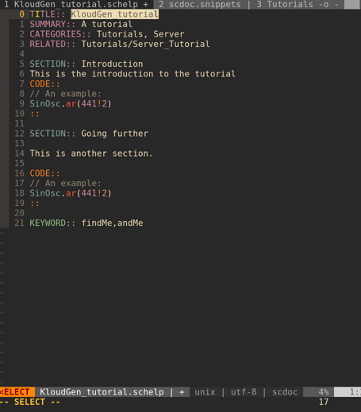

# vim-supercollider-snippets

Snippet files for SuperCollider filetypes to be used with the UltiSnips plugin.

Because these snippets were mostly made with SCNvim in mind (which has autogenerated snippets for all classes) it does not contain snippets for regular classes but for slightly more advanced examples and techniques that are often repeated. 

It also contains snippets for scdoc help files.

## Requirements
* Python 3
* [UltiSnips](https://github.com/SirVer/ultisnips)
* [SuperCollider](https://github.com/supercollider/supercollider)
* [scvim](https://github.com/supercollider/scvim) or [scnvim](github.com/davidgranstrom/scnvim)

## Install
Follow your plugin managers instructions.

To install using vim-plug
1. Add this to your init.vim / .vimrc:
`Plug 'madskjeldgaard/vim-supercollider-snippets'`
2. Open Vim and run the command `:PlugInstall`
