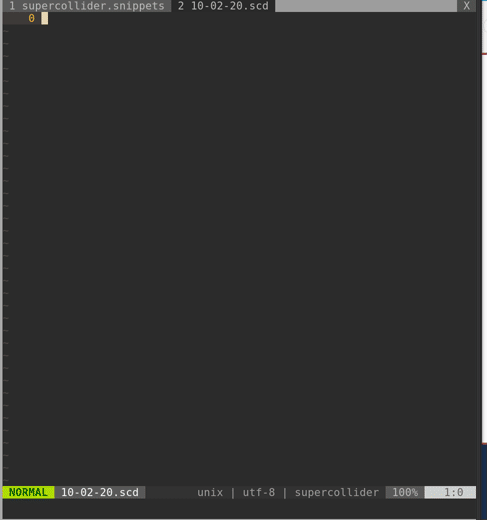
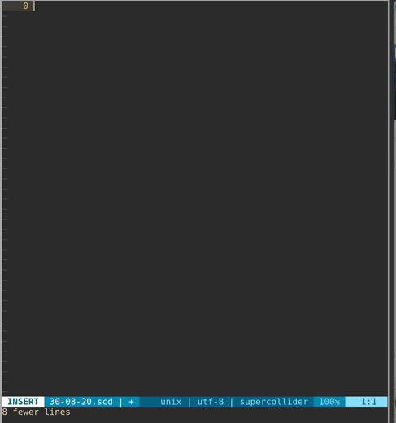
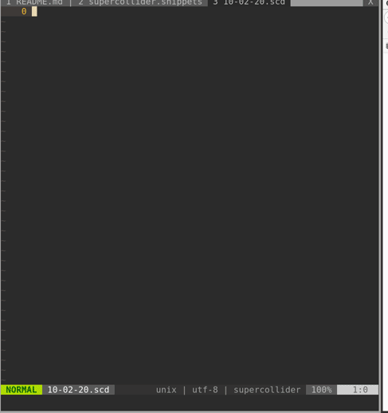

# [EXPERIMENTAL] vim-supercollider-snippets

Snippet files for SuperCollider filetypes to be used with the UltiSnips plugin.

Covers both normal supercollider files . 

See `:h supercollider-snippets` for more info.

# Experimental
This plugin is in an experimental state and not recommended for use at the moment. It has some loopback problems with the python interpolation causing python to self implode and nvim to crash from time to time.

## See also

- [scnvim](https://github.com/davidgranstrom/scnvim) / [scvim](https://github.com/supercollider/scvim)
- [vim-scdoc-snippets](https://github.com/madskjeldgaard/vim-scdoc-snippets)
- [supercollider-h4x-nvim](https://github.com/madskjeldgaard/supercollider-h4x-nvim)

## Python interpolation
The snippets make extensive use of Python interpolation to do various things.

Mostly this is used to put random values in classes every time the snippet is expanded.

For example with pattern classes always suggesting random values (that you can then choose to delete if you want to)

Or always initialising an Ndef with a random fruit name and random contents:

## Requirements
* Python 3
* [UltiSnips](https://github.com/SirVer/ultisnips)
* [SuperCollider](https://github.com/supercollider/supercollider)
* [scvim](https://github.com/supercollider/scvim) or [scnvim](github.com/davidgranstrom/scnvim)

## Install
To install using vim-plug
1. Add this to your init.vim / .vimrc:
`Plug 'madskjeldgaard/vim-supercollider-snippets'`
2. Open Vim and run the command `:PlugInstall`

Otherwise, follow your plugin manager's instructions.
