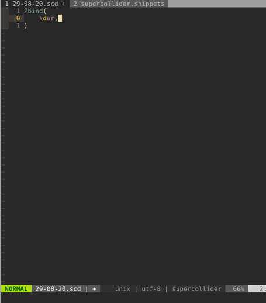
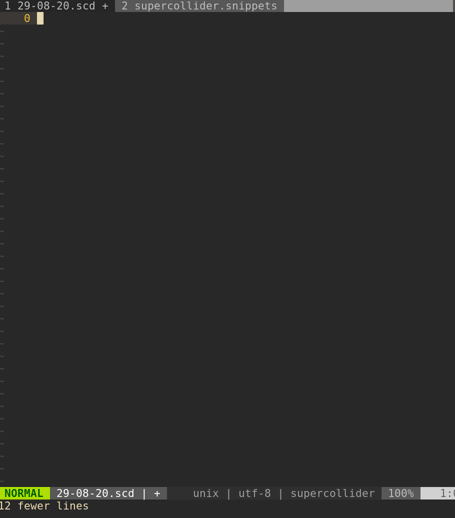

# vim-supercollider-snippets

Snippet files for SuperCollider filetypes to be used with the UltiSnips plugin.

Covers both normal supercollider files and the full scdoc syntax. 

See `:h supercollider-snippets` for more info.

## Python interpolation
The snippets make extensive use of Python interpolation to do various things.

Mostly this is used to put random values in classes every time the snippet is expanded.

For example with pattern classes always suggesting random values (that you can then choose to delete if you want to)

Or always initialising an Ndef with a random LFO:

## Requirements
* Python 3
* [UltiSnips](https://github.com/SirVer/ultisnips)
* [SuperCollider](https://github.com/supercollider/supercollider)
* [scvim](https://github.com/supercollider/scvim) or [scnvim](github.com/davidgranstrom/scnvim)

## Install
To install using vim-plug
1. Add this to your init.vim / .vimrc:
`Plug 'madskjeldgaard/vim-supercollider-snippets'`
2. Open Vim and run the command `:PlugInstall`

Otherwise, follow your plugin manager's instructions.
